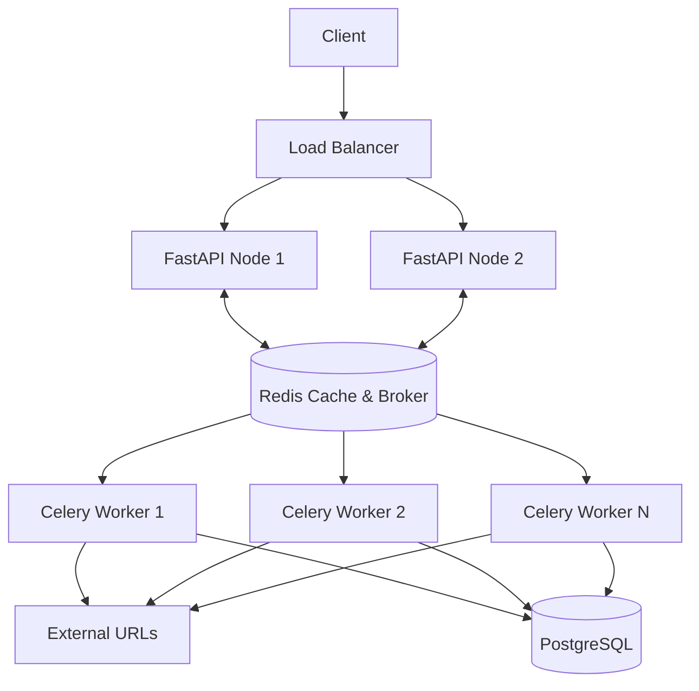

# TASK B: Design for Scale

## Architecture Document

To handle 10,000 audits per day and bursts of 500 concurrent requests while maintaining a strict SLA, the Q-Pulse architecture separates the API reception from the background worker execution.

### Components:
1. **API Gateway / Load Balancer**: Nginx or AWS ALB, responsible for SSL termination and distributing traffic.
2. **FastAPI Application**: The core API service, handles validation, rate-limiting, and immediate cache reads.
3. **Redis (Cache & Message Broker)**: Serves as the caching layer for completed audits and the queue broker for background tasks.
4. **Celery Workers**: Background workers that consume from the Redis queue, perform the HTTP audits, and write results back to the database and cache.
5. **PostgreSQL (Persistent State)**: The source of truth for all historical audit logs, client configurations, and analytics.

### Data Flow & Queueing Strategy
1. A client submits a `POST /audit`.
2. FastAPI checks **Redis** for a cached result. If present, it returns immediately.
3. If not cached, FastAPI pushes an audit task to the **Celery Queue** (via Redis) and either waits for the result (using a pub/sub mechanism or polling with a short timeout) or immediately returns an "Accepted" status for async polling (depending on exact SLA needs). For synchronous bursts of 500, FastAPI uses `asyncio.Semaphore` to throttle outgoing connections if handled inline, or relies on auto-scaling Celery workers to absorb the queue.
4. **Celery Workers** pop tasks, perform the HTTP request with a 5s timeout, write the result to **PostgreSQL**, and update the **Redis** cache.

### Mermaid Architecture Diagram

## Technology Decision Record

- **Redis**: Chosen for caching and as a message broker due to its high throughput and low latency. 
  - *Alternative Rejected*: RabbitMQ (for broker) and Memcached (for cache). Redis was chosen to consolidate the stack, reducing operational complexity while easily handling our scale.
- **Celery**: Chosen for background task processing.
  - *Alternative Rejected*: Built-in FastAPI `BackgroundTasks`. FastAPI background tasks run in the same event loop/process. Under a burst of 500 heavy HTTP requests, this could block the main API event loop. Celery allows isolated, horizontally scalable worker nodes.
- **PostgreSQL**: Chosen for persistent state and analytics.
  - *Alternative Rejected*: MongoDB. The audit data is highly structured (URL, timestamp, status code, response time), and relational queries (e.g., average uptime per domain) are much more efficient in a SQL environment.

## Failure Mode Analysis

1. **Failure Mode**: Target URL Timeout / Slow Response (Thundering Herd)
   - *Mitigation*: Implemented a strict 5-second timeout on all outbound HTTP requests. The Celery workers will quickly fail and release resources rather than hanging indefinitely.
2. **Failure Mode**: Redis Instance Crash
   - *Mitigation*: Run Redis in a High Availability setup (Redis Sentinel or AWS ElastiCache). If Redis is unreachable, the FastAPI app is configured to fail open (bypass cache and hit the database/worker directly) or return a graceful 503 rather than crashing the whole API.
3. **Failure Mode**: Burst of 500+ Concurrent Requests Overwhelming Workers
   - *Mitigation*: The Celery queue acts as a shock absorber. Requests are queued immediately, and the API responds without blocking. Auto-scaling rules on the worker group will spin up additional nodes if the queue length exceeds a threshold.

## Operations Plan

- **Metrics to Monitor**:
  - API Request Rate & Error Rate (4xx, 5xx)
  - API P95 and P99 Latency
  - Redis Cache Hit/Miss Ratio
  - Celery Queue Length & Worker Utilization
  - Outbound HTTP Request Timeouts
- **Alerts to Configure**:
  - PagerDuty alert if API 5xx error rate exceeds 1% over 5 minutes.
  - Slack alert if Celery queue length exceeds 1,000 pending tasks (indicating workers can't keep up).
  - Alert if Redis memory usage exceeds 80%.
- **Rollback Process**:
  1. Detect anomaly via Datadog/Prometheus alerts following a deployment.
  2. Identify the last known good commit in GitHub.
  3. Revert the CI/CD pipeline to deploy the previous Docker image tag.
  4. Run automated database downgrade scripts (if the bad deploy included a schema change).
  5. Monitor metrics for 15 minutes to confirm the system has recovered to a healthy state.
  6. Conduct a post-mortem to identify the root cause of the bad deployment.
